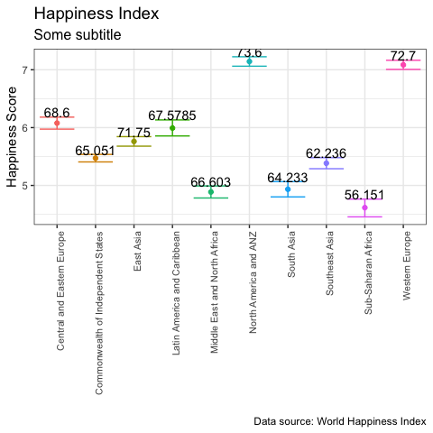
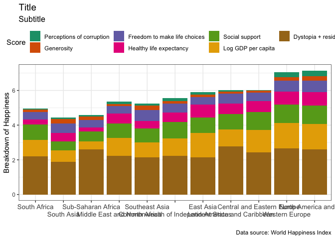

# Purpose

The purpose of this project is preparation for the final Data science
Exam

``` r
rm(list = ls()) # Clean your environment:
gc() # garbage collection - It can be useful to call gc after a large object has been removed, as this may prompt R to return memory to the operating system.
```

    ##          used (Mb) gc trigger (Mb) limit (Mb) max used (Mb)
    ## Ncells 462807 24.8     987648 52.8         NA   669314 35.8
    ## Vcells 858994  6.6    8388608 64.0      16384  1840043 14.1

``` r
library(tidyverse)
```

    ## ── Attaching packages ─────────────────────────────────────── tidyverse 1.3.2 ──
    ## ✔ ggplot2 3.4.0     ✔ purrr   1.0.1
    ## ✔ tibble  3.2.1     ✔ dplyr   1.1.0
    ## ✔ tidyr   1.3.0     ✔ stringr 1.5.0
    ## ✔ readr   2.1.4     ✔ forcats 0.5.2
    ## ── Conflicts ────────────────────────────────────────── tidyverse_conflicts() ──
    ## ✖ dplyr::filter() masks stats::filter()
    ## ✖ dplyr::lag()    masks stats::lag()

``` r
list.files('code/', full.names = T, recursive = T) %>% .[grepl('.R', .)] %>% as.list() %>% walk(~source(.))
```

Create Question Folders

``` r
# CHOSEN_LOCATION <- "/Users/wesleywilliams/Desktop/School/Masters/FirstSemester/DataScience/MOCK EXAM/"
# 
# 
# Texevier::create_template(directory = glue::glue("{CHOSEN_LOCATION}Solution/21691126/"), template_name = "Question1")
# Texevier::create_template(directory = glue::glue("{CHOSEN_LOCATION}Solution/14623579/"), template_name = "Question2")
```

#Question 1

``` r
list.files('/Users/wesleywilliams/Desktop/School/Masters/FirstSemester/DataScience/MOCK EXAM/Solution/21691126/Question1/code/', full.names = T, recursive = T) %>% as.list() %>% walk(~source(.))

happy <- Data_Collating(Datroot = "/Users/wesleywilliams/Desktop/School/Masters/FirstSemester/DataScience/MOCK EXAM/Solution/21691126/Question1/data/Happy")
```

``` r
g <- plotter1(happy)

   g
```


<p class="caption">
Plot1.
</p>

``` r
barplot <- happy %>% 
    group_by(`Regional indicator`) %>% 
    summarise_at((vars(c(starts_with("Explained by"), `Dystopia + residual`, `Ladder score`))), ~median(.))

sabarplot <- happy %>% 
  filter(`Country name` == "South Africa") %>% 
    summarise_at((vars(c(starts_with("Explained by"), `Dystopia + residual`, `Ladder score`))), ~median(.)) 

barplot <- bind_rows(barplot, sabarplot)
barplot[11,1] <- "South Africa"

barplot <- barplot %>% 
    gather(Score, Value, -`Regional indicator`,-`Ladder score`) %>% 
    mutate(Score = gsub("Explained by: ", "", Score))

#need to get the ordering right, South africa and then all of the regions in desending life ladder values\

order1 <- c("South Africa",
            happy %>% group_by(`Regional indicator`) %>% summarise(Lad = mean(`Ladder score`)) %>% arrange(Lad) %>% pull(`Regional indicator`))
order2 <- barplot %>% group_by(Score) %>% summarise(Avg = mean(Value)) %>% arrange(Avg) %>% pull(Score)

g <-
barplot %>%
    plot_orderset(., Column = "Regional indicator", Order = order1) %>%
    plot_orderset(., Column = "Score", Order = order2) %>%
    ggplot() + geom_bar(aes(`Regional indicator`, y = Value, fill = Score), stat = "identity", position = "stack") +
    theme_bw() +
    scale_fill_brewer(palette="Dark2") +
    scale_x_discrete(guide = guide_axis(n.dodge = 2)) +
    labs(title = "Title", subtitle = "Subtitle", caption = "Data source: World Happiness Index", x = "", y = "Breakdown of Happiness") +
    theme(legend.position = "top", legend.title = element_text()) +
    theme(plot.title = element_text(size = 14),
          plot.subtitle = element_text(size = 12), axis.text.x = element_text(size = 10)) +
    guides(fill = guide_legend())

g
```


<p class="caption">
Plot2.
</p>
